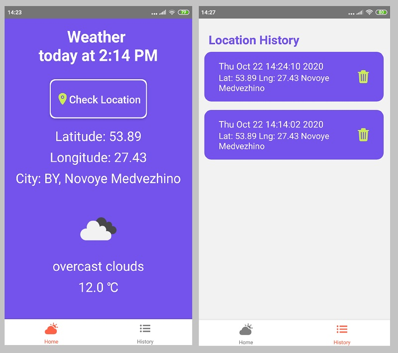

# Geolocation React Native App

Simple React Native wather application 

  - Setup your environment according to the instruction on https://reactnative.dev/docs/environment-setup
  - install dependences
  - Create in root .env file with OPEN_WEATHER_MAP_TOKEN=[your_token]

# Features

  - Hooks
  - Permissions
  - Ionicons
